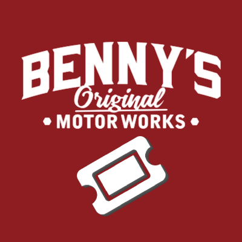

[![Contributors][contributors-shield]][contributors-url]
[![Forks][forks-shield]][forks-url]
[![Stargazers][stars-shield]][stars-url]
[![Issues][issues-shield]][issues-url]
[![project_license][license-shield]][license-url]

 

  

<h3 align="center">Ticket Bot pro Frakce na Nábor</h3>

  

    Tento Discord bot vytvoří ticketový systém pro nábor do frakce na FiveM RP serveru

<!-- OBSAH -->

  
Obsah

  <ol>
    <li>
      <a href="#něco-o-projektu">Něco o projektu</a>
      <ul>
        <li><a href="#napsáno-ve">Napsáno ve</a></li>
      </ul>
    </li>
    <li><a href="#menší-to-do-list-do-budoucna">To Do List</a></li>
  </ol>

<!-- NĚCO O PROJEKTU -->
## Něco o projektu

Jednoho dne kdy jsem vlastnil s kamarádem frakci Benny's tak jsem se rozhodl udělat trochu odlišně nábory. Udělal jsem ještě i bota na Recenze a kdo bude chtít celý script tak můžu klidně udělat další repository. 

### Napsáno ve

* [![Index][Index.js]][Index-url]

<!-- TODOLIST -->
## Menší To Do List do budoucna

- [ ] Ticket se bude ukládat při uzavření
- [ ] Transcript

<!-- MARKDOWN LINKS & IMAGES -->
<!-- https://www.markdownguide.org/basic-syntax/#reference-style-links -->
[contributors-shield]: https://img.shields.io/github/contributors/github_username/repo_name.svg?style=for-the-badge
[contributors-url]: https://github.com/Domdik/TicketProFrakceNaNabor/graphs/contributors
[forks-shield]: https://img.shields.io/github/forks/github_username/repo_name.svg?style=for-the-badge
[forks-url]: https://github.com/Domdik/TicketProFrakceNaNabor/network/members
[stars-shield]: https://img.shields.io/github/stars/github_username/repo_name.svg?style=for-the-badge
[stars-url]: https://github.com/Domdik/TicketProFrakceNaNabor/stargazers
[issues-shield]: https://img.shields.io/github/issues/github_username/repo_name.svg?style=for-the-badge
[issues-url]: https://github.com/Domdik/TicketProFrakceNaNabor/issues
[license-shield]: https://img.shields.io/github/license/github_username/repo_name.svg?style=for-the-badge
[license-url]: https://github.com/Domdik/TicketProFrakceNaNabor/blob/main/LICENSE
[linkedin-shield]: https://img.shields.io/badge/-LinkedIn-black.svg?style=for-the-badge&logo=linkedin&colorB=555
[linkedin-url]: https://linkedin.com/in/linkedin_username
[product-screenshot]: images/screenshot.png
[Index.js]: https://img.shields.io/badge/index.js-383025?style=for-the-badge&logo=indexdotjs&logoColor=white
[Index-url]: https://nodejs.org/en
[React.js]: https://img.shields.io/badge/React-20232A?style=for-the-badge&logo=react&logoColor=61DAFB
[React-url]: https://reactjs.org/
[Vue.js]: https://img.shields.io/badge/Vue.js-35495E?style=for-the-badge&logo=vuedotjs&logoColor=4FC08D
[Vue-url]: https://vuejs.org/
[Angular.io]: https://img.shields.io/badge/Angular-DD0031?style=for-the-badge&logo=angular&logoColor=white
[Angular-url]: https://angular.io/
[Svelte.dev]: https://img.shields.io/badge/Svelte-4A4A55?style=for-the-badge&logo=svelte&logoColor=FF3E00
[Svelte-url]: https://svelte.dev/
[Laravel.com]: https://img.shields.io/badge/Laravel-FF2D20?style=for-the-badge&logo=laravel&logoColor=white
[Laravel-url]: https://laravel.com
[Bootstrap.com]: https://img.shields.io/badge/Bootstrap-563D7C?style=for-the-badge&logo=bootstrap&logoColor=white
[Bootstrap-url]: https://getbootstrap.com
[JQuery.com]: https://img.shields.io/badge/jQuery-0769AD?style=for-the-badge&logo=jquery&logoColor=white
[JQuery-url]: https://jquery.com 
